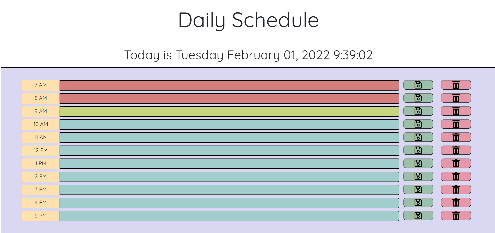
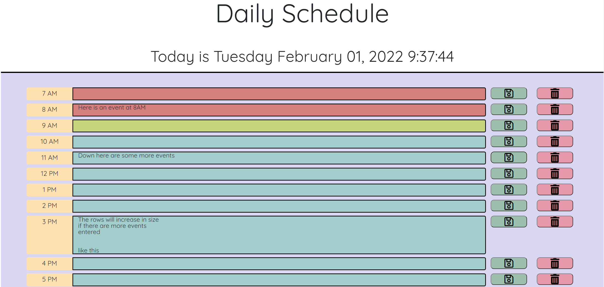

# AG-calendar

## App usage:
This is a simple daily planner app. The current date and time are shown at the time and there are 11 blocks representing the hours of a work day.
The elements change color based on the time of day: the current hour is displayed in green, past hours are red, and future hours are blue. These elements are editable via a click.
There are two buttons to the right of each row: a save (green with a disc icon) and a clear (red with a trash icon). The save button saves the contents of the hour is to memory and the clear clears them out.

Daily planner upon page load

Planner in use

### Future Development:

I would consider adding an additional interval function to change the color of each hour block in real time to reflect the current time of day, not just on page load.